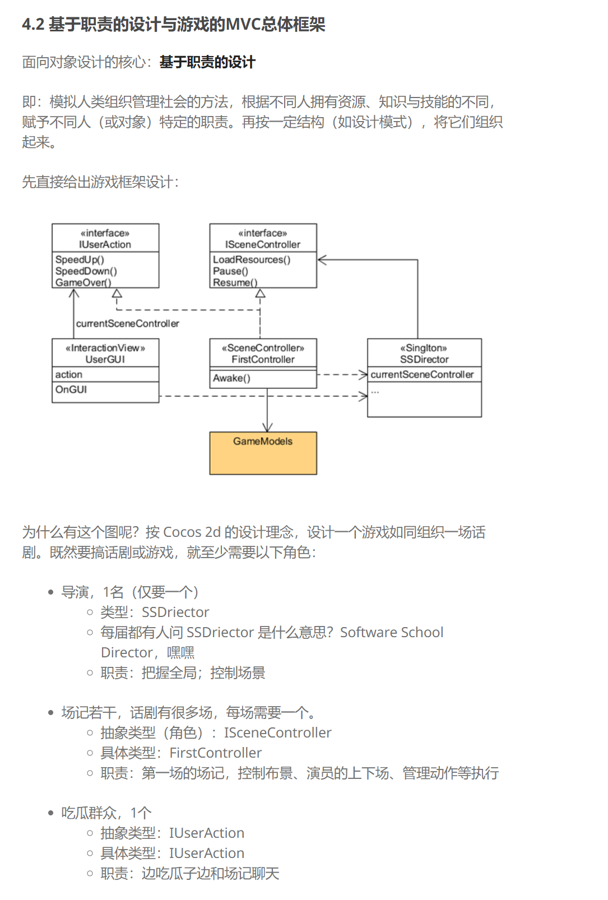

# unity3d

[3D Game Programming & Design](https://pmlpml.github.io/unity3d-learning/) homework

## c# fundamental

### coroutine

https://docs.unity3d.com/Manual/Coroutines.html

协程可以执行异步yield语句

协程由[StartCoroutine](https://docs.unity3d.com/ScriptReference/MonoBehaviour.StartCoroutine.html)执行

协程中每次调用`yield return null`都会让代码等到下一帧再继续执行，`yield return new WaitForSeconds()`可以等待一段时间

用处：一个要持续几秒的事件；几秒后发生的动作；

### delegate & event

类似于函数指针，实例化一个委托而进行函数调用。委托可以使用+-运算进行多播，即委托合并。

event可以实例化委托，作为订阅-发布模式的事件，delegate中注册的函数是订阅者，event是发布者

https://www.runoob.com/csharp/csharp-event.html

## 设计模式总结

### Composite Pattern(组合模式)

将对象组合成树形结构以表示“部分-整体”的层次结构，组合模式使得用户对单个对象和组合对象的使用具有一致性。其实就是把场景中的椅子作为桌子的child，通过操纵桌子就可以对桌子和椅子这个整体进行操作。

事实上，unity的对象设计就是一种组合模式，inspector中可以添加删除的components就是如此。

调用`BroadcastMessage()`可以调用该对象以及其children的函数。

### MVC/MIC

这个是上3D课作业每次都用到的最基本的结构。Model是场景中的物体；Controller从下而上有：物体上挂载的对应controller，场景中的IScenecontroller，和最上层的Director；View，其实我认为GUI中的控制部分也属于Controller，场景中显示的东西（包括界面）是View。

MIC是模型、交互与控制模式，交互和MVC中的View类似。

`src/MVC_Base_Scripts`是MVC的基本框架，这个代码框架的目的是**解耦**，每个场景有一个controller，这样就避免使用了Find等高耦合的方法，场景编辑器中只有一个空object，用代码加载所有的资源和挂载脚本，这样的职责划分是面向对象的思想。
  * `SSDirector`: 整个游戏的单例director
  * `ISceneController, IUserAction`: I指interface，规定要实现的方法，这是Facade Pattern(门面模式)
  * `FirstController`: 第一个场景的controller，继承ISceneController, IUserAction，管理场景中的gameobjects，负责实现游戏逻辑
  * `XXManager`: 场景中gameobject的管理器，在初始化时加载资源并挂载对应脚本
  * `XXControl`: 场景中gameobject挂载的脚本，其中IUserAction属性把SceneController转换为IUserAction，用于调用物体动作
  * `CCActionManager`: 用队列管理所有物体的动作，可以减少XXControl的负担。动作管理系统的结构大制包含动作基类、执行动作类、管理类、回调类，在使用时通过actionmanager把每个动作放入Dictionary容器，容器挨个执行动作。加入动作管理器后，可以从每个物体的manager中把运动代码抽出来，用单独的CCActionManager进行管理，在场记调度运动相关时只需要调用CCActionManager的接口即可。一个明显的好处是，实现有一个物体运动时其他运动无法触发，在action队列中进行判断即可。
  * `Singleton`: 任何需要单例的对象调用`Singleton<YourMonoType>.Instance`即可

### Publisher-Subscriber(订阅-发布模式)/Observer(观察者模式)

https://gameinstitute.qq.com/community/detail/120064

MVC降低了模块耦合，模块间通信变得困难，观察者模式可以用c#的delegate和event实现模块间通信。

观察者模式中，场景控制器是订阅者，子组件是发布者，以此实现子组件向场记发送消息。比如人物碰撞出现时需要掉血，main controller需要修改数值，就可以通过这一模式发送消息。语法上，delegate&event将main controller需要订阅的函数进行注册，在事件发生时调用event。
