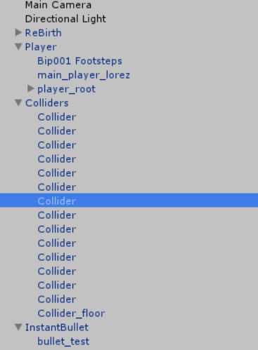
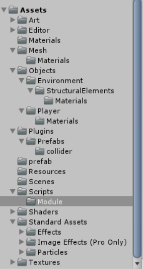
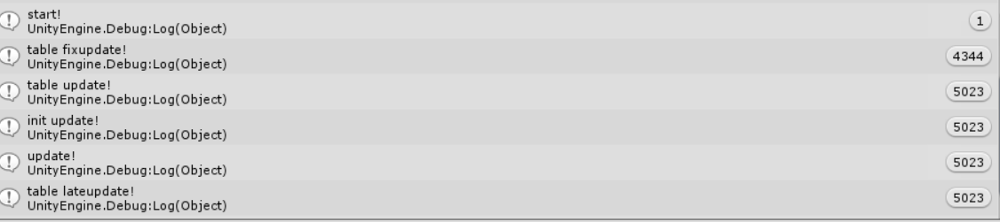
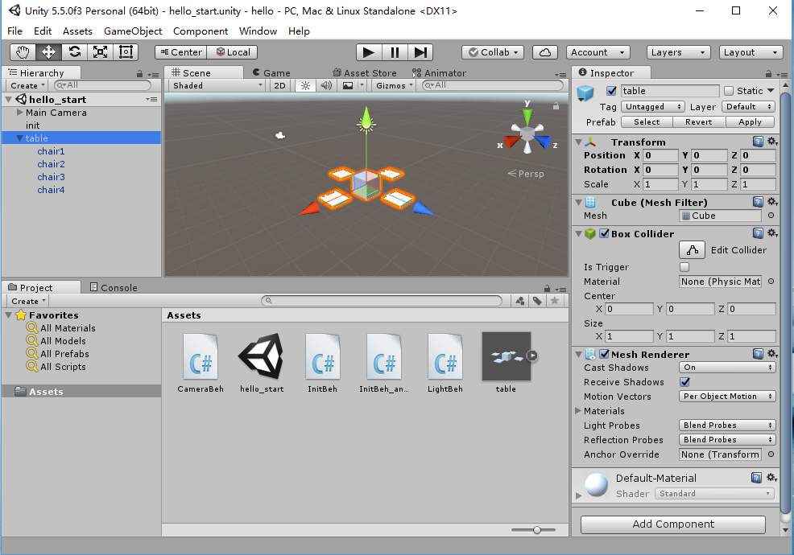
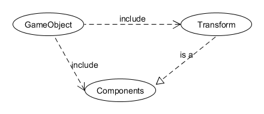
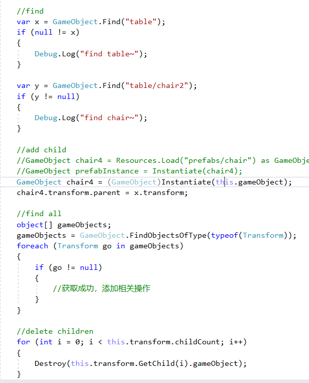
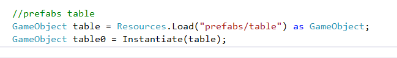

###解释游戏对象（GameObjects） 和 资源（Assets）的区别与联系
GameObjects是游戏的组成元素和物体，Assets是可用于这些元素上的资源，如材料、模型，也可以是操纵他们的脚本，Assets一般依附于GameObjects上  

###下载几个游戏案例，分别总结资源、对象组织的结构（指资源的目录组织结构与游戏对象树的层次结构）

这是一个控制人物移动和射击的游戏，GameObjects结构主要包括player、bullet和colliders，最后一个用于处理碰撞；Assets中除了控制场景中物体的脚本外，还有环境的图片、材质和模板

###编写一个代码，使用 debug 语句来验证 MonoBehaviour 基本行为或事件触发的条件
* 基本行为包括 Awake() Start() Update() FixedUpdate() LateUpdate()
* 常用事件包括 OnGUI() OnDisable() OnEnable()

FixedUpdate()是在每一个时间片执行一次，是规律的，而Update（）是按帧数执行，也就是帧数低的时候执行次数就少

>OnGUI is called for rendering and handling GUI events.This means that your OnGUI implementation might be called several times per frame (one call per event)

这是文档中对OnGui()的描述，所以这是一个处理gui事件的函数

OnDisable()和OnEnable()是在脚本被销毁或者生成时触发的函数
    

###查找脚本手册，了解 GameObject，Transform，Component 对象
* 分别翻译官方对三个对象的描述（Description）

GameObjects
>Every object in your game is a GameObject, from characters and collectible items to lights, cameras and special effects. 

你的游戏中的每一个物体都是一个GameObject，从人物、收集品到光线、镜头都是GameObject。

Transform
>The Transform component determines the Position, Rotation, and Scale of each object in the scene. Every GameObject has a Transform.

Transform决定了场景中每一个物体的位置、旋转和缩放，每一个GameObject都有一个Transform属性。

Component
>Components are the nuts & bolts of objects and behaviors in a game. They are the functional pieces of every GameObject.

Components是游戏中对象和行为的组件，他们是GameObject的基本成分。

* 描述下图中 table 对象（实体）的属性、table 的 Transform 的属性、 table 的部件

table是一个GameObject，table的transform属性决定了它的位置（1，1，1），components中有属性Cube，代表这是一个立方体，还有长方体的box collider决定碰撞模型，还有网格渲染器mesh renderer决定它的样式

* 用 UML 图描述 三者的关系（请使用 UMLet 14.1.1 stand-alone版本出图）

###整理相关学习资料，编写简单代码验证以下技术的实现：
* 查找对象
* 添加子对象
* 遍历对象树
* 清除所有子对象

###资源预设（Prefabs）与 对象克隆 (clone)
* 预设（Prefabs）有什么好处？

预设可以减少操作量，并且对一样的重复物体进行批量操作

* 预设与对象克隆 (clone or copy or Instantiate of Unity Object) 关系？

克隆不能对克隆对象进行批量操作，如修改表面材质，而prefabs可以

* 制作 table 预制，写一段代码将 table 预制资源实例化成游戏对象

###尝试解释组合模式（Composite Pattern / 一种设计模式）

>组合模式，将对象组合成树形结构以表示“部分-整体”的层次结构，组合模式使得用户对单个对象和组合对象的使用具有一致性。

组合模式其实就是上课讲的例子里把椅子放到桌子中，可以对桌子和椅子这个整体进行操作。

* 使用 BroadcastMessage() 方法向子对象发送消息

`function BroadcastMessage (methodName : string, parameter : object = null, options : SendMessageOptions = SendMessageOptions.RequireReceiver) : void`

调用所有MonoBehaviour的methodName方法

`BroadcastMessage("ApplyDamage", 5.0F);`

